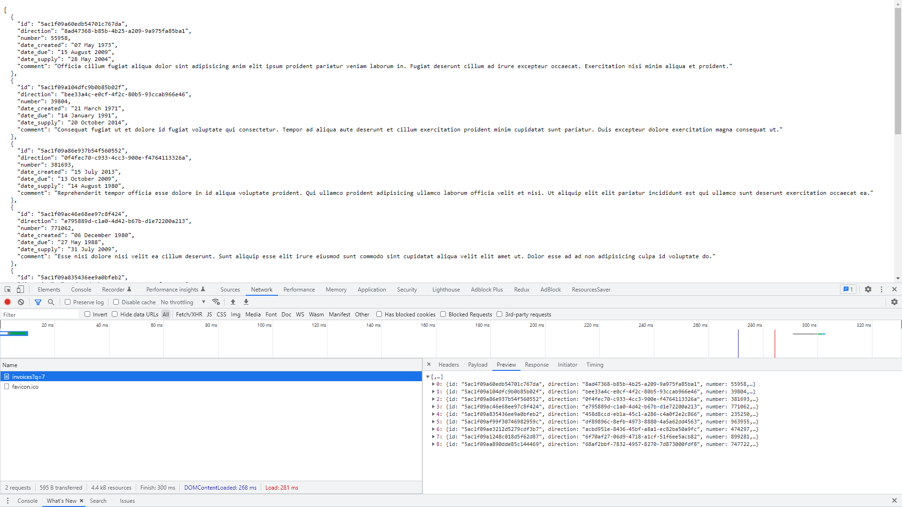
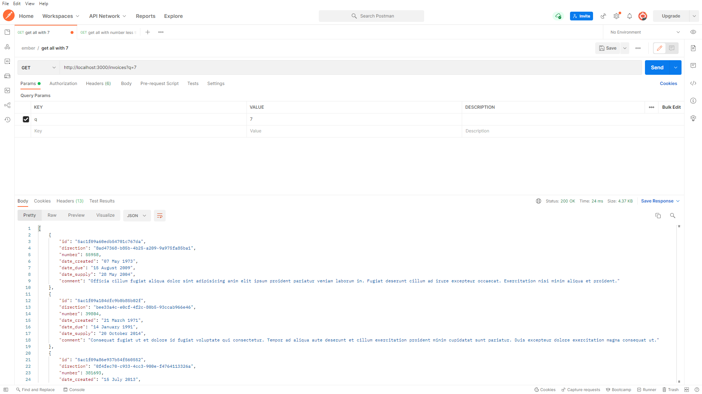
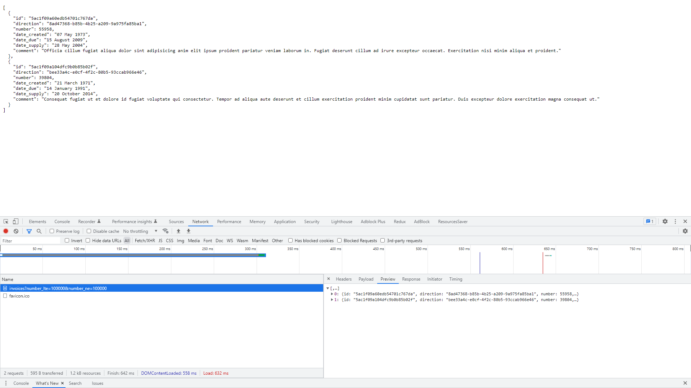
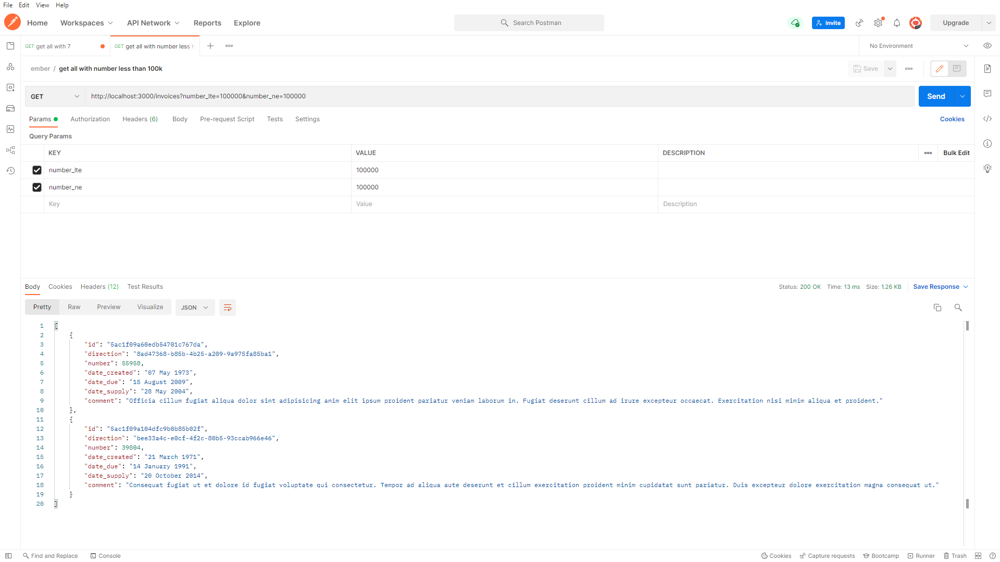

## Получение всех накладных, любое поле которых содержит цифру “7”
### Chrome:

### Postman:

## Получение всех накладных, значение поля number которых меньше “100000”
### Chrome:

### Postman:

